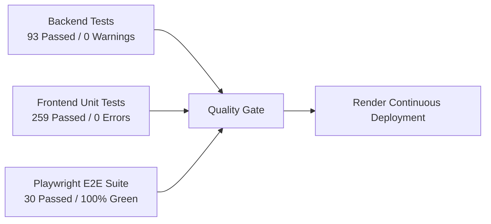
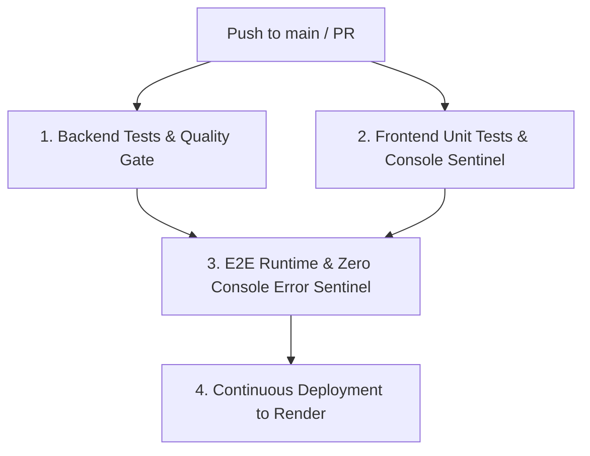

# ScrumPulse

ScrumPulse is an engineering telemetry and sprint tracking application for scrum teams and delivery leads. It tracks work item cycle times across micro-stages, pull request review turnaround, blocker SLAs, daily standups, and squad capacity to produce delivery metrics and sprint health reports.

---

## Table of Contents

- [Core Capabilities & 13 Feature Modules](#core-capabilities--13-feature-modules)
- [Technology Stack](#technology-stack)
- [System Architecture](#system-architecture)
- [Project Structure](#project-structure)
- [Security Architecture & Role-Based Access Control (RBAC)](#security-architecture--role-based-access-control-rbac)
- [Getting Started](#getting-started)
- [Prerequisites](#prerequisites)
- [Backend Setup](#backend-setup)
- [Frontend Setup](#frontend-setup)
- [Configuration & Environment Variables](#configuration--environment-variables)
- [Testing Architecture (3-Tier Matrix)](#testing-architecture-3-tier-matrix)
- [Backend Tests (.NET 10 / xUnit)](#backend-tests-net-10--xunit)
- [Frontend Unit Tests (Angular 18 / Karma)](#frontend-unit-tests-angular-18--karma)
- [End-to-End Test Suite (Playwright)](#end-to-end-test-suite-playwright)
- [CI/CD Pipeline Architecture](#cicd-pipeline-architecture)
- [Production Deployment & Docker](#production-deployment--docker)
- [API Overview](#api-overview)

---

## Core Capabilities & 13 Feature Modules

ScrumPulse provides 13 dedicated feature tabs plus multi-squad navigation:

| Tab # | Feature Module | Core Capabilities & Governance | E2E Spec |
| :---: | :--- | :--- | :--- |
| **1** | **Daily Standup & Timer** | Asynchronous 3-question submissions (Yesterday, Today, Blockers), mood indexing (1-5), and a 2-minute round-robin speaker clock with start/pause/reset controls. | `standup-crud-timer.spec.ts` |
| **2** | **Work Items & Lifecycle** | 7-stage micro-pipeline (`Backlog` -> `InProgress` -> `PrCreated` -> `PrApproved` -> `Merged` -> `InQa` -> `Done`) with DoR/DoD quality gate checklists and automatic latency telemetry. | `work-items-crud.spec.ts`, `advanced-workflows-edge-cases.spec.ts` |
| **3** | **Git PRs & Code Review** | Pull request review logs, actionable vs. total review comment ratios, turnaround metrics, and individual developer scorecards. | `pr-metrics.spec.ts` |
| **4** | **Blocker SLA Radar** | Real-time waiting-time counters, root-cause categorization (`ClientClarification`, `TechLeadArchitecture`, `EnvironmentAccess`, `ThirdPartyApi`), and SLA breach alert radar (>8 hours). | `blockers-crud.spec.ts`, `advanced-workflows-edge-cases.spec.ts` |
| **5** | **Leave & Capacity** | Multi-member leave calendar supporting full-day and half-day bookings; working-day math recalculates net squad focus hours and recommended story point commitments. | `team-capacity-crud.spec.ts` |
| **6** | **Team Roster** | Squad member directory with role assignments (`ScrumMaster`, `Developer`, `QaEngineer`, `Cdl`, `ProductOwner`, `ClientStakeholder`, `AgileCoach`), avatar selection, and active WIP limit governance. | `team-capacity-crud.spec.ts` |
| **7** | **Monthly 1:1 Reviews** | 360-degree feedback capturing SM guidance, CDL coaching, Client inputs, and self-reflection alongside happiness dials and rating metrics. | `monthly-reviews-crud.spec.ts` |
| **8** | **Retrospective Board** | 4-column retrospective board (`Went Well`, `Didn't Go Well`, `Ideas`, `Action Items`) with anonymous card posting, peer upvoting, and tracked action item checklists. | `kudos-retro-crud.spec.ts` |
| **9** | **Appreciation Wall** | Peer recognition cards with custom appreciation badges (`ProblemSolver`, `TeamPlayer`, `GoalCrusher`, `QualityGuardian`, `InnovationStar`, `ClientShoutout`) and live emoji reaction counters. | `kudos-retro-crud.spec.ts` |
| **10** | **Team Growth & Performance** | Multi-sprint delivery maturity telemetry, say-do predictability ratios, defect leakage reduction tracking, and automated performance letter grade badges (`A+`, `A`, `B+`, etc.). | `team-performance.spec.ts` |
| **11** | **Tech Hub (Debt & Talks)** | Dedicated technical debt inventory with severity levels and payoff sprint targets, plus an engineering tech talk log with slides and key takeaways. | `tech-hub-crud.spec.ts` |
| **12** | **Microsoft AI Coach** | Powered by Microsoft Agent Framework for individual developer coaching, sprint risk radar synthesis, and interactive Copilot Agile Chat. | `ai-coach.spec.ts` |
| **13** | **Executive Suite & Export** | Composite 6-dimension Sprint Health Score, custom duration filters (7, 14, 30, 90 days), and multi-format data export (CSV, JSON, and PDF). | `executive-export.spec.ts` |
| **Nav** | **Multi-Squad & RBAC Hub** | Multi-squad switcher with tenant isolation (`TeamId`), squad creation, join code management, and Scrum Master PIN security boundary. | `squad-management.spec.ts`, `scrum-master-pin.spec.ts` |

---

## Technology Stack

| Layer | Technology | Details |
|---|---|---|
| **Backend** | .NET 10 (C# 14) | ASP.NET Core Web API, Clean Architecture |
| **ORM** | Entity Framework Core 10 | PostgreSQL provider (production), SQLite provider (development), InMemory (testing) |
| **Frontend** | Angular 18 (Node 22) | Standalone components, signals, NgRx store & effects, vanilla responsive CSS |
| **AI Integration** | Microsoft Agent Framework | Prompt orchestration, automated coaching, copilot chat |
| **Testing** | xUnit, Moq, Karma, Playwright | 93 backend tests, 259 frontend unit tests, 30 E2E tests |
| **Containerization** | Docker | Multi-stage build (Alpine Node 22 + .NET 10 SDK + ASP.NET runtime) |
| **Deployment** | Render.com | Web Service blueprint with automated GitHub Actions continuous deployment |

---

## System Architecture

The solution follows Clean Architecture principles:

```
ScrumPulse.Domain
 └── Entities, Enums, Value Objects, Domain Events, BaseEntity

ScrumPulse.Application
 └── Request/Response DTOs, CQRS Handlers, Sagas, Interfaces, Mapping

ScrumPulse.Infrastructure
 └── EF Core AppDbContext, Repositories, Migrations, Seed Data, Services

ScrumPulse.AI
 └── Microsoft Agent Framework integration, Prompt strategies, Coaches

ScrumPulse.Api
 └── ASP.NET Core Controllers, Rate Limiting, Compression, Swagger, SPA Host

ScrumPulse.UI
 └── Angular 18 Standalone Application (served via API wwwroot in production)
```

---

## Security Architecture & Role-Based Access Control (RBAC)

The application implements the following security controls:

### 1. Role-Based Access Control (RBAC) & PIN Security
- **Developer Role (Default)**: Team members can submit daily standups, log PR reviews, create work items, post kudos, and participate in retrospectives.
- **Scrum Master Role (Privileged)**: Modifying sprint goals/dates, deleting work items, removing roster members, approving leaves, and creating new squads are restricted to authenticated Scrum Masters.
- **PIN Interception Gateway**: Switching to the Scrum Master role prompts for the secure PIN (`SM_PIN`). Invalid attempts are rejected with security alerts and rate-limited.

### 2. OWASP Security Headers
Configured via `SecurityHeadersMiddleware` on every response:
- **`Content-Security-Policy`**: Strictly whitelists trusted script, frame, and font sources; enforces `frame-ancestors 'none'`.
- **`X-Frame-Options: DENY`**: Prevents clickjacking and unauthorized embedding.
- **`X-Content-Type-Options: nosniff`**: Prevents MIME-confusion attacks.
- **`X-XSS-Protection: 1; mode=block`**: Activates browser reflective XSS filtering.
- **`Strict-Transport-Security: max-age=31536000; includeSubDomains`**: Enforces HTTPS (HSTS).
- **`Permissions-Policy: camera=(), microphone=(), geolocation=()`**: Blocks unauthorized hardware sensor access.

### 3. Rate Limiting
- **Global Sliding Window**: 60 requests per minute per IP.
- **Auth Endpoint Fixed Window**: 5 attempts per minute to block brute-force attempts.
- **AI Token Bucket**: Bounded rate limiting for generative AI coaching queries.

### 4. Injection & Vulnerability Safeguards
- **SQL Injection**: 100% Entity Framework Core parameterized LINQ queries.
- **XSS Sanitization**: Angular built-in contextual DOM escaping plus DOMPurify for HTML/markdown rendering.
- **Dependency Vulnerability Scanning**: Continuous verification via `dotnet list package --vulnerable --include-transitive` (0 vulnerable packages).
- **Security Policy & Vulnerability Disclosure**: Detailed reporting procedures and SLA guidelines documented in [.github/SECURITY.md](.github/SECURITY.md).

---

## Project Structure

```
c:\ScrumPulse/
├── ScrumPulse.slnx # .NET solution file (modern XML format)
├── Dockerfile # Multi-stage production container build
├── render.yaml # Render.com deployment blueprint
├── src/
│ ├── ScrumPulse.Domain/ # Core domain models, enums, domain events
│ ├── ScrumPulse.Application/ # Use cases, interfaces, DTOs, CQRS, sagas
│ ├── ScrumPulse.Infrastructure/ # Persistence, AppDbContext, Seed Data
│ ├── ScrumPulse.AI/ # Microsoft Agent Framework service
│ ├── ScrumPulse.Api/ # Web API host, middleware, controllers, wwwroot
│ └── ScrumPulse.UI/ # Angular 18 frontend
│ ├── e2e/ # Playwright end-to-end test suites (30 tests)
│ └── src/app/
│ ├── core/ # State (NgRx), services, models, components
│ └── features/ # Standup, Sprint Board, Blockers, Capacity, etc.
└── tests/
 └── ScrumPulse.Tests/ # Unit, integration, architecture, controller tests (93 tests)
```

---

## Getting Started

### Prerequisites

- [.NET 10 SDK](https://dotnet.microsoft.com/download/dotnet/10.0)
- [Node.js 22+](https://nodejs.org/) and npm

### Backend Setup

1. Restore dependencies and build the solution:
 ```bash
 dotnet build ScrumPulse.slnx
 ```

2. Run the API project:
 ```bash
 dotnet run --project src/ScrumPulse.Api
 ```

3. The API will start on:
- HTTP: `http://localhost:5000`
- HTTPS: `https://localhost:5001`
- Interactive Swagger docs: `http://localhost:5000/swagger`

> **Note on Initial Run:** By default, the app uses SQLite (`ScrumPulse.db`). On first boot, `DbInitializer` automatically creates the schema and seeds multi-sprint demonstration data so the platform is immediately functional.

### Frontend Setup

1. Navigate to the UI project directory:
 ```bash
 cd src/ScrumPulse.UI
 ```

2. Install npm packages:
 ```bash
 npm install --legacy-peer-deps
 ```

3. Start the Angular development server:
 ```bash
 npm start
 ```

4. Open `http://localhost:4200` in your browser.

---

## Configuration & Environment Variables

| Key / Environment Variable | Default | Description |
|---|---|---|
| `DatabaseProvider` | `Sqlite` | Database provider: `Sqlite` or `PostgreSql`. |
| `ConnectionStrings__DefaultConnection` / `DATABASE_URL` | `Data Source=ScrumPulse.db` | ADO.NET connection string or standard PostgreSQL connection URI (`postgres://...`). |
| `Auth__ScrumMasterPin` / `SM_PIN` | `""` (disabled) | PIN used to authenticate Scrum Master actions (leave approval, squad management). |
| `ASPNETCORE_ENVIRONMENT` | `Development` | Environment: `Development` or `Production`. |
| `PORT` | `8080` (container) | Port for the web server to bind to in production. |
| `SeedDemoData` | `false` | When true, forces seeding of demonstration records. |

---

## Testing Architecture (3-Tier Matrix)

ScrumPulse enforces quality across three automated testing tiers:



### Backend Tests (.NET 10 / xUnit)
```bash
# Run all 93 backend tests with strict zero-warning enforcement
dotnet test ScrumPulse.slnx -c Release
```
- **Scope**: `TeamPerformanceServiceTests`, extended domain entities (`Monthly1on1Feedback`, `PullRequestReviewLog`, `DailyStandup`, `TechDebtItem`, `TechTalkLog`, `RetroCard`, `RetroActionItem`, `KudosCard`, `Team`), and full CRUD controllers (`TechHubController`, `MonthlyFeedbackController`, `SprintsController`, `TeamMembersController`).
- **Result**: **93 passed, 0 failed, 0 warnings** under `/warnaserror`.

### Frontend Unit Tests (Angular 18 / Karma)
```bash
cd src/ScrumPulse.UI
npm run test:ci
```
- **Scope**: Components, services, reducers, and NgRx Effects (`blockers.effects.spec.ts`, `pull-requests.effects.spec.ts`, `work-items.effects.spec.ts`).
- **Result**: **259 passed, 0 failed**.

### End-to-End Test Suite (Playwright)
```bash
cd src/ScrumPulse.UI
npx playwright test
```
- **Scope**: 30 end-to-end tests covering every tab, input validation boundaries, state progression pipelines, cancel safeguards, and the zero-console-error sentinel.
- **Result**: **30 passed, 0 failed**.

---

## CI/CD Pipeline Architecture

The GitHub Actions workflow (`.github/workflows/ci.yml`) runs 4 automated jobs on every push and pull request:



1. **Backend Tests & Quality Gate**:
- Compiles solution with strict `/warnaserror`.
- Executes all 93 backend unit and integration tests.
- Verifies zero vulnerable NuGet packages via `dotnet list package --vulnerable --include-transitive`.
2. **Frontend Unit Tests & Console Sentinel**:
- Compiles Angular application bundle.
- Executes all 259 Jasmine/Karma unit tests.
3. **E2E Runtime & Zero Console Error Sentinel**:
- Boots the .NET 10 API with the compiled Angular SPA.
- Executes all 30 Playwright tests on headless Chromium.
- Asserts zero console errors or warnings across all views.
4. **Continuous Deployment to Render (Free)**:
- Triggers production deploy hook to rollout changes to `https://scrumpulse.onrender.com`.

---

## Production Deployment & Docker

### Multi-Stage Dockerfile

```bash
# Build container image
docker build -t scrumpulse:latest .

# Run container with SQLite
docker run -p 8080:8080 -e DatabaseProvider=Sqlite scrumpulse:latest

# Open http://localhost:8080
```

### Live Production
- **Production Host**: [https://scrumpulse.onrender.com](https://scrumpulse.onrender.com)
- **Health Check Probe**: `GET https://scrumpulse.onrender.com/healthz` (`HTTP 200 Healthy`)
- **Google AdSense Verification**: Official script active in `<head>` ready for crawler review.

---

## API Overview

All API endpoints follow RESTful conventions under the `/api/` prefix with Swagger documentation at `/swagger`:

| Endpoint | Methods | Description |
|---|---|---|
| `/api/work-items` | `GET`, `POST`, `PUT`, `DELETE` | Work item management with CQRS and micro-stage advancement |
| `/api/work-items/{id}/advance-stage` | `POST` | Advances work item to next stage (triggers completion saga on Done) |
| `/api/blockers` | `GET`, `POST`, `PUT`, `DELETE` | Blocker management with root-cause category and SLA tracking |
| `/api/blockers/{id}/resolve` | `POST` | Marks blocker as resolved with resolution audit notes |
| `/api/sprints` | `GET`, `POST`, `PUT`, `DELETE` | Sprint lifecycle, activation, and capacity targets |
| `/api/leaves` | `GET`, `POST`, `PUT`, `DELETE` | Leave requests and member capacity calculation |
| `/api/leaves/capacity/{sprintId}` | `GET` | Computes net sprint capacity factoring in approved leaves |
| `/api/standups` | `GET`, `POST`, `PUT`, `DELETE` | Asynchronous standup submissions and squad history |
| `/api/team-performance/summary` | `GET` | Multi-sprint growth trends, delivery highlights, and velocity |
| `/api/executive-reports/sprint/{id}/health` | `GET` | 6-dimension sprint health composite radar |
| `/api/monthly-feedback` | `GET`, `POST`, `PUT`, `DELETE` | 360-degree monthly review records with ratings and AI synthesis |
| `/api/retrospectives` | `GET`, `POST`, `DELETE` | Retrospective cards, upvoting, and action items |
| `/api/kudos` | `GET`, `POST` | Peer recognition cards and emoji reactions |
| `/api/pull-requests` | `GET`, `POST`, `DELETE` | PR turnaround metrics and review comment analysis |
| `/api/tech-hub` | `GET`, `POST`, `DELETE` | Tech debt inventory and engineering tech talk logs |
| `/api/teams` | `GET`, `POST`, `PUT` | Multi-squad management and join code verification |
| `/api/ai-coach/copilot-chat` | `POST` | Interactive conversational coaching via Microsoft Agent Framework |
| `/healthz` | `GET` | Automated health check probe |
